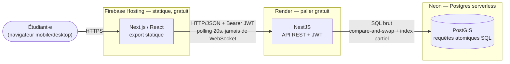

# CestomClash228

PWA géolocalisée d'entraide et de survie gamifiée pour la diaspora étudiante togolaise au Maroc,
construite avec et pour la CESTOM. Projet présenté au concours **CréaAfrica 2026** (phase
éliminatoire, 13 septembre 2026).

**Statut** : projet clôturé — MVP complet construit, déployé en production, testé (83 tests
backend automatisés + parcours réels rejoués en direct), présenté au jury. Les services
d'hébergement ont été volontairement arrêtés après la présentation (aucune carte bancaire
n'ayant jamais été engagée sur aucun des trois, l'arrêt n'a aucune incidence financière — voir
`docs/POST_MORTEM_ARCHITECTURE.md` § 4.2). Le code, lui, reste entièrement fonctionnel et
relançable.

## Architecture — vue d'ensemble



Deux process de déploiement indépendants (frontend statique, backend serveur), zéro connexion
persistante entretenue par le client, chaque écriture sensible à la concurrence protégée par une
requête SQL atomique plutôt qu'une logique applicative. Le détail complet — pourquoi chaque choix,
ce qui a été écarté, ce qui casse à l'échelle — est dans le document d'architecture ci-dessous,
pas ici : ce README reste un point d'entrée, pas une redite.

## Documentation

- [`docs/POST_MORTEM_ARCHITECTURE.md`](docs/POST_MORTEM_ARCHITECTURE.md) — **le document de
  référence** : genèse chronologique du projet (y compris le pivot d'infrastructure
  Vercel/Supabase → Firebase/Render/Neon), cartographie complète de l'architecture déployée,
  matrice des décisions et trade-offs, audit sans concession des forces et faiblesses du système.
- [`docs/APPRENTISSAGE/top-15-fichiers-maitres.md`](docs/APPRENTISSAGE/top-15-fichiers-maitres.md)
  — les 15 fichiers qui portent la vraie logique métier du projet, lus et expliqués un par un.
- [`docs/REVISION_JURY.md`](docs/REVISION_JURY.md) — script de pitch, préparation aux questions du
  jury, business case.
- [`docs/ARCHIVE/`](docs/ARCHIVE/) — documents de cadrage et de stratégie antérieurs
  (`VISION.md`, `STACK.md`, `ARCHITECTURE.md`, `BUSINESS_PLAN.md`, `LEAN_CANVAS.md`...), remplacés
  dans leur contenu narratif par le post-mortem ci-dessus, conservés pour l'historique plutôt que
  supprimés.
- [`pitch/`](pitch/) — deck de pitch (`.pptx`, régénérable via `generate-deck.mjs`) et script oral.

## Lancer le projet en local

```
docker compose -f infra/docker-compose.yml up -d   # PostgreSQL + PostGIS
cd apps/api && npm run start:dev                    # API NestJS — http://localhost:3001
cd apps/web && npm run dev                           # Frontend Next.js — http://localhost:3000
```

`apps/api/.env` et `apps/web/.env.local` sont à configurer depuis les fichiers `.env.example`
correspondants (les instances de production ne sont plus actives, voir la section Statut
ci-dessus).
